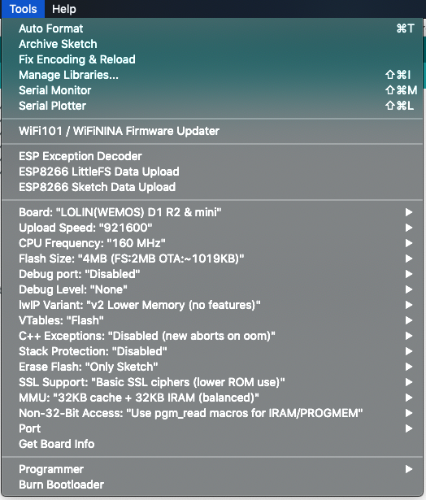

# Try "First test" to check your ESPboy after assembling
www.espboy.com project

# ESP8266 doc links

ESPboy uses the ESP8266 microcontroller, which uses the Xtensa Tensilica 32-Bit RISC CPU LX106 core

1. [ESP8266 Arduino Core Documentation](https://arduino-esp8266.readthedocs.io/_/downloads/en/latest/pdf/)
2. [ESP8266 Arduino Core](https://arduino-esp8266.readthedocs.io/en/stable/ideoptions.html)
3. [ESP8266 Technical Reference](https://www.espressif.com/sites/default/files/documentation/esp8266-technical_reference_en.pdf)
4. [ESP8266_RTOS_SDK (IDF Style) Programming Guide](https://docs.espressif.com/projects/esp8266-rtos-sdk/en/latest/get-started/index.html)
5. [Tensilica 32-Bit Risc CPU Xtensa LX106](https://softwareg.com.au/blogs/computer-hardware/tensilica-32-bit-risc-cpu-xtensa-lx106)
6. [Xtensa® Instruction Set Architecture ISA Summary](https://www.cadence.com/content/dam/cadence-www/global/en_US/documents/tools/silicon-solutions/compute-ip/isa-summary.pdf)

# Using Ardublock

ESPboy_ArdublockFirstTest -- uses [Ardublock.ru v3](http://ardublock.ru/3/)
   
# Using MicoJS

MicoJS documentation https://github.com/micojs/micojs.github.io/wiki
MicoJS itself https://micojs.github.io

# Using MicroPython

https://micropython.org

# Start using the [Arduino IDE](https://www.arduino.cc) or [PlarformIO](https://platformio.org)

1. Install Arduino IDE legacy 1.8.n recommended (not v2.n IDE) https://www.arduino.cc/en/Main/Software

2. Install the WeMos D1 mini ESP866 board to your Arduino IDE https://www.instructables.com/Wemos-ESP8266-Getting-Started-Guide-Wemos-101/

3. Install all the libs for ESPboy from here https://github.com/ESPboy-edu/ESPboy_ArduinoIDE_Libraries

4. Select the "LOLIN(WEMOS) D1 R2 & mini" board in the Arduino IDE and compile this code

5. Test ESPboy hardware:
- Power on
- 8 buttons
- Display TFT and its backlit
- RGB led
- Buzzer/Speaker

6. For better experience you have to istall to your Arduino IDE ["Little FS file uploader plugin"](https://github.com/earlephilhower/arduino-esp8266littlefs-plugin) and ["ESP exception decoder plugin"](https://github.com/me-no-dev/EspExceptionDecoder)

7. If you want to have professinal development tool much more powerfull than standard Arduino IDE, learn ["VS Code" + "PlatformIO"](https://circuitsgeek.com/guides-and-how-to/programming-esp8266-using-vs-code-and-platformio/)

8. [Use recommended Arduino IDE settings](https://github.com/ESPboy-edu/ESPboy_FirstTest/blob/master/settings.png)

# Basic ESPboy examples for Arduino IDE

There are few ways to use ESPboy + Arduino IDE with different most common Arduino graphics libraries

1. ESPboy_FristTest_AdafruitLibs - does not use custom ESPboy libs and uses only standard [Adafruit libraries (slow and poor, but simple)](https://github.com/adafruit/Adafruit-ST7735-Library) to control ESPboy hardware (LED, buttons, sound, display)

2. ESPboy_FirstTest_ESPboyLibs_TFTeSPI -- *uses ESPboy libs* and [TFT_eSPI (recommended)](https://github.com/Bodmer/TFT_eSPI?ysclid=ln67tav62z348840877) graphics library for display (be carefull, to force it work properly with ESPboy's display you have to edit parameters in "User_Setup.h" file in TFT_eSPI library folder according [to this](https://github.com/ESPboy-edu/ESPboy_ArduinoIDE_Libraries/blob/master/TFT_eSPI-master/User_Setup.h) )

3. ESPboy_FirstTest_ESPboyLibs_LovyanGFX -- *uses ESPboy libs* and [LovyanGFX (most advanced)](https://github.com/lovyan03/LovyanGFX) graphics library for display

4. ESPboy_FirstTest_ESPboyLibs_ArduinoGFX -- *uses ESPboy libs* and [GFX_Library_for_Arduino (cool)](https://github.com/moononournation/Arduino_GFX) graphics library for display

# Try "First test" examples to start programming

1. Use this example to start coding with ESPboy

2. To init ESPboy hardware use begin() of [ESPboy_Init class](https://github.com/ESPboy-edu/ESPboy_Classes)

3. For doing graphics use methods of [TFT_eSPI class](https://github.com/Bodmer/TFT_eSPI) or [Adafruit ST7735 lib](https://github.com/adafruit/Adafruit-ST7735-Library) or [LovyanGFX lib](https://github.com/lovyan03/LovyanGFX) or [ArduinoGFX](https://github.com/moononournation/Arduino_GFX?ysclid=m3vfcm8qub54799678) according to your GFX-way choice

4. For buttons use getkeys() of ESPboyInit and keypressed&PAD_LEFT, keypressed&PAD_RIGHT and so on to understand what key is exactly pressed

5. For LED use ESPboy_LED class https://github.com/ESPboy-edu/ESPboy_Classes or NeoPixel https://github.com/adafruit/Adafruit_NeoPixel

6. For sound use playTone(frequency, duration), playTone (frequency) and noPlayTone() methods of ESPboy_Init class https://github.com/ESPboy-edu/ESPboy_Classes 

7. To control the LCD backlit use Adafruit MCP4725 library methods https://github.com/adafruit/Adafruit_MCP4725 (not supported in ESPboy easy DIY versions)

8. To upload data (files) to internal flash file system use Arduino IDE plugins: 

a) [Little FS](https://github.com/earlephilhower/arduino-esp8266littlefs-plugin)

b) [SPIFFS](https://github.com/esp8266/arduino-esp8266fs-plugin)

9. To upload to ESPboy already compiled ".bin" files, use [Flash Download Tools](https://github.com/SequoiaSan/Guide-How-To-Upload-bin-to-ESP8266-ESP32)

10. You can try [alternate ESPboy lib, made by Steph](https://www.arduino.cc/reference/en/libraries/espboy/) and [instructions](https://m1cr0lab-espboy.github.io/ESPboy)

11. Use ESP8266 Arduino Core documentation https://arduino-esp8266.readthedocs.io/en/latest/index.html

12. Use [WebAppStore](https://espboy.m1cr0lab.com/demo/appstore/) and WiFiAppStore directly from the device (first install "AppStore2 (OTA2)" from the WebAppStore)

13. Ask questions in [ESPboy forum](https://community.arduboy.com) and ESPboy [discord chat](https://discord.gg/kMWhY2x)

14. Have FUN! :)

Regards,
Roman
//

MIT License

Copyright (c) 2020 ESPboy

Permission is hereby granted, free of charge, to any person obtaining a copy
of this software and associated documentation files (the "Software"), to deal
in the Software without restriction, including without limitation the rights
to use, copy, modify, merge, publish, distribute, sublicense, and/or sell
copies of the Software, and to permit persons to whom the Software is
furnished to do so, subject to the following conditions:

The above copyright notice and this permission notice shall be included in all
copies or substantial portions of the Software.

THE SOFTWARE IS PROVIDED "AS IS", WITHOUT WARRANTY OF ANY KIND, EXPRESS OR
IMPLIED, INCLUDING BUT NOT LIMITED TO THE WARRANTIES OF MERCHANTABILITY,
FITNESS FOR A PARTICULAR PURPOSE AND NONINFRINGEMENT. IN NO EVENT SHALL THE
AUTHORS OR COPYRIGHT HOLDERS BE LIABLE FOR ANY CLAIM, DAMAGES OR OTHER
LIABILITY, WHETHER IN AN ACTION OF CONTRACT, TORT OR OTHERWISE, ARISING FROM,
OUT OF OR IN CONNECTION WITH THE SOFTWARE OR THE USE OR OTHER DEALINGS IN THE
SOFTWARE.
